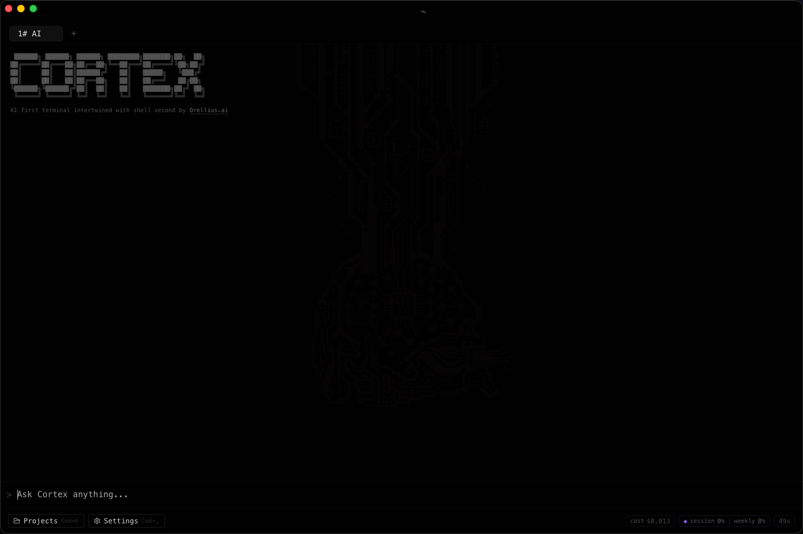
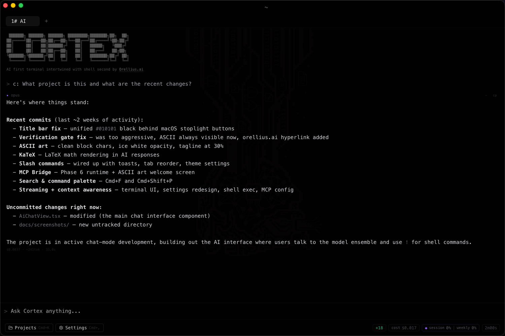
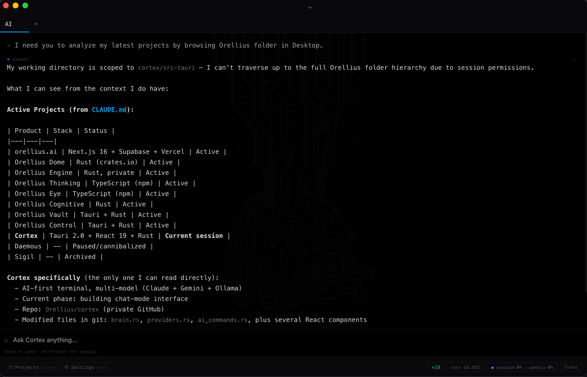
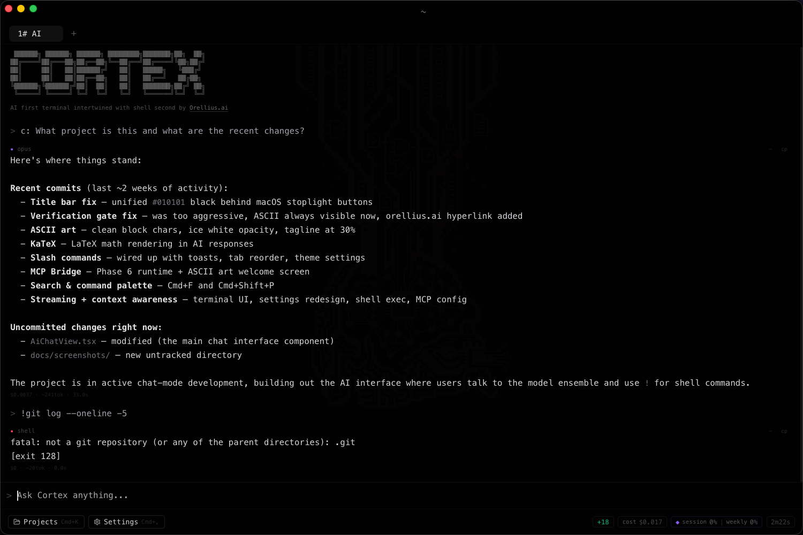
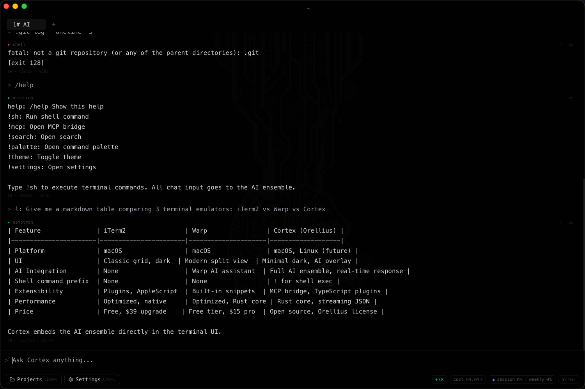
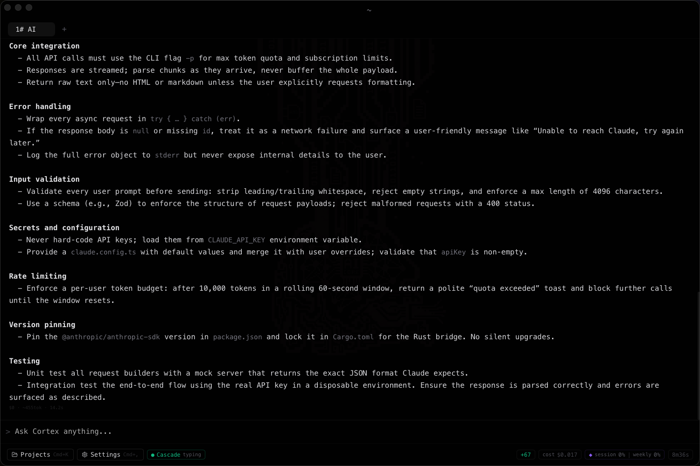

# Cortex

**AI-first multi-model terminal. One interface, every model, no switching.**

```
 ██████╗ ██████╗ ██████╗ ████████╗███████╗██╗  ██╗
██╔════╝██╔═══██╗██╔══██╗╚══██╔══╝██╔════╝╚██╗██╔╝
██║     ██║   ██║██████╔╝   ██║   █████╗   ╚███╔╝
██║     ██║   ██║██╔══██╗   ██║   ██╔══╝   ██╔██╗
╚██████╗╚██████╔╝██║  ██║   ██║   ███████╗██╔╝ ██╗
 ╚═════╝ ╚═════╝ ╚═╝  ╚═╝   ╚═╝   ╚══════╝╚═╝  ╚═╝
```

> AI first terminal intertwined with shell second by [Orellius.ai](https://orellius.ai)
> Built by [Orel](https://github.com/Orellius)

---

## Screenshots

| | |
|---|---|
| **Welcome** | **Context-aware AI** |
|  |  |
| ASCII welcome, unified black UI, session tabs | Reads cwd, git status, CLAUDE.md, file tree |
| **Local model (Nemotron)** | **Shell + AI in one flow** |
|  |  |
| Local models are context-aware too | `!` prefix runs commands inline |
| **Slash commands + markdown** | **Rich markdown rendering** |
|  |  |
| `/help`, tables, code blocks, LaTeX | Headers, bullets, inline code, bold |

---

## What it is

Cortex is a native desktop terminal that puts Claude and local Ollama models alongside a real shell in one window. You type in a single input. The router decides which model to call based on what you wrote. Responses stream token-by-token. All models share the same MCP tool bridge.

There is no chat bubble UI, no sidebar with a robot avatar. Just a terminal.

---

## Features

### Multi-model AI

Three tiers run simultaneously. The router picks the right one automatically.

| Provider | Models | When used |
|---|---|---|
| Claude (CLI) | sonnet (default), opus, haiku | Code, debugging, implementation |
| Claude Sonnet | sonnet | Research, explanation, comparison |
| Ollama | any local model (qwen, nemotron, deepseek, llama) | Simple queries, local-only, budget cap fallback |

Force a provider with a prefix:

```
c: implement a binary search in Rust
s: explain the difference between Arc and Rc
l: what does grep do
```

Automatic routing uses deterministic complexity scoring (no ML). Keywords like `implement`, `fix`, `refactor` score high and route to Claude. Questions like `what is` or `explain` route to Sonnet. Short lookups route to local.

### Streaming

Responses stream token-by-token from both Claude CLI and Ollama. Claude streams via stdout pipe reading, Ollama via NDJSON SSE. No waiting for a complete response before rendering.

### Context awareness

Before every AI query, Cortex reads:

- Current working directory (where you launched Cortex from)
- Git branch and `git status --short`
- Top-level project files
- Stack detection (Rust, TypeScript, Python, Tauri)
- `CLAUDE.md` if present in the project root

This context is injected automatically. You do not need to paste file contents into prompts.

### Conversation memory

The last 20 messages per session are persisted to SQLite and included as history on every query. Conversations survive tab switches and app restarts.

### Shell execution

Prefix any message with `!` to run it as a shell command inside the AI chat:

```
!ls -la
!git status
!cargo check
```

Output appears inline, not in a separate terminal pane.

### Slash commands

| Command | Action |
|---|---|
| `/clear` | Clear current conversation |
| `/help` | Show available commands |
| `/model` | Show routing info |
| `/settings` | Open settings overlay |
| `/search` | Activate search |
| `/palette` | Open command palette |
| `/budget` | Show today's spend and daily cap |

### LaTeX math rendering

Model responses containing LaTeX notation (`\[...\]`, `\(...\)`, `$$...$$`) render as formatted equations via KaTeX.

### Verification gate

Local model outputs pass through a verification layer. If the output fails consistency checks (garbage, hallucination signals, AI-speak), a warning is prepended. The gate is smart enough to allow short answers when you ask short questions.

### Budget metering

Claude CLI calls are cost-estimated and logged to SQLite. When the daily budget cap is reached, the router falls back to Ollama for all queries. Default daily cap: $5.00. Local models and CLI subscriptions are free.

### MCP Bridge (Phase 6)

Cortex runs a Model Context Protocol bridge that starts configured MCP servers on launch via JSON-RPC over stdio. All models share the same tool registry. MCP servers are configured in `~/.cortex/mcp.toml` and can be imported from your Claude Code `settings.json`.

### Terminal

- Full PTY via `portable-pty` (real shell, not a subprocess wrapper)
- xterm.js v6 with DOM renderer
- Split panes: `Cmd+D` (vertical), `Cmd+Shift+D` (horizontal)
- Each pane gets its own PTY process

### Tab management

- Session numbering: `1# AI`, `2# Shell`, `3# AI`
- Double-click tab to rename
- Drag to reorder
- `Cmd+Shift+T` to reopen closed tabs (10-tab recovery stack)
- Session state persists across quit and relaunch

### Search

`Cmd+F` activates search in both AI chat (text filter with opacity dimming) and shell (xterm addon-search with match highlighting).

### Command palette

`Cmd+Shift+P` opens a fuzzy command palette listing all available actions with keyboard navigation.

### Global hotkey

`Ctrl+`` ` toggles the window from anywhere on the system (quake-style drop-down).

### Settings (9 pages)

Sidebar layout with lucide-react icons. Opened with `Cmd+,` or `/settings`.

| Tab | Contents |
|---|---|
| Models | Per-role model assignment, auto-optimize, CLI detection |
| Providers | API keys, Ollama endpoint, connection testing |
| Routing | Complexity scoring thresholds, override rules |
| Budget | Daily cap, spend history, cost breakdown |
| Permissions | Safe / Ask / Auto / Bypass modes |
| MCP Servers | Add/remove/toggle, import from Claude Code |
| Appearance | Font size, font family, cursor style, accent color, opacity |
| Shortcuts | Keyboard shortcut reference |
| About | Version, stack, config paths, links |

### Toast notifications

Update notifications with action buttons (Update / Skip). Used for model updates, MCP server changes, and system alerts.

---

## Keyboard shortcuts

| Shortcut | Action |
|---|---|
| `Cmd+T` | New AI tab |
| `Cmd+W` | Close tab |
| `Cmd+1` to `Cmd+9` | Switch to tab N |
| `Cmd+D` | Split pane vertically |
| `Cmd+Shift+D` | Split pane horizontally |
| `Cmd+F` | Search in current pane |
| `Cmd+Shift+P` | Command palette |
| `Cmd+,` | Open settings |
| `Cmd+K` | Project launcher |
| `Cmd+Shift+H` | Paste history |
| `Cmd+Shift+T` | Reopen closed tab |
| `Ctrl+`` ` | Toggle window (global) |
| `Enter` | Submit query |
| `Shift+Enter` | New line in input |

---

## Installation

### Prerequisites

- macOS 13+ (Ventura or later)
- [Rust](https://rustup.rs/) 1.77.2+
- [Node.js](https://nodejs.org/) 20+
- [pnpm](https://pnpm.io/) 10+
- [Tauri CLI](https://tauri.app/v2/guides/getting-started/prerequisites/) v2

For AI features (optional but recommended):

- [Claude Code CLI](https://claude.ai/code) for Claude provider
- [Ollama](https://ollama.ai/) for local model provider

### Build from source

```bash
git clone https://github.com/Orellius/cortex-terminal
cd cortex
pnpm install
cargo tauri dev
```

Production build:

```bash
cargo tauri build
```

The `.dmg` installer outputs to `src-tauri/target/release/bundle/dmg/`.

---

## Configuration

All config lives in `~/.cortex/`. Created automatically on first launch.

### `~/.cortex/config.toml`

```toml
claude_model = "sonnet"
ollama_model = "nemotron-cascade-2"
ollama_endpoint = "http://localhost:11434"
daily_budget_usd = 5.0
permission_mode = "ask"
```

### `~/.cortex/mcp.toml`

```toml
[[servers]]
name = "filesystem"
command = "npx"
args = ["-y", "@modelcontextprotocol/server-filesystem", "~/"]
enabled = true
```

### `~/.cortex/identity.md`

Optional. Write your name, role, preferred coding style, or project context. This is prepended to every AI query as identity injection. All models read this file and respond as "Cortex".

---

## Architecture

```
cortex/
├── src/                        # React 19 frontend
│   ├── components/
│   │   ├── ai/                 # AiChatView, AiMessage, AiChatInput
│   │   ├── settings/           # 9-page settings (sidebar layout)
│   │   ├── TabBar.tsx          # Tab management, drag reorder, rename
│   │   ├── StatusBar.tsx       # Git branch, cost, Claude usage
│   │   ├── CommandPalette.tsx  # Fuzzy action search
│   │   └── Toast.tsx           # Notification system
│   ├── hooks/                  # useTerminal, useTabs, useKeyboard
│   └── types.ts
│
└── src-tauri/                  # Rust backend
    └── src/
        ├── ai/
        │   ├── router.rs       # Complexity-scored query routing
        │   ├── providers.rs    # Claude CLI + Ollama streaming
        │   ├── brain.rs        # Context injection (cwd, git, CLAUDE.md)
        │   ├── mcp.rs          # MCP bridge (JSON-RPC stdio)
        │   ├── verification.rs # Output verification gate
        │   ├── database.rs     # SQLite persistence
        │   └── config.rs       # config.toml + mcp.toml
        ├── commands/           # Tauri IPC handlers
        ├── pty.rs              # PTY manager (one thread per pane)
        └── lib.rs              # App setup, state registration
```

### How it works

1. You type a query in the terminal input
2. The router scores it (0-10) based on word signals
3. Score 5+ goes to Claude, 3-4 to Sonnet, 0-2 to local Ollama
4. The provider streams tokens back via `cortex:ai:stream` events
5. Context (cwd, git, CLAUDE.md) is injected into every prompt automatically
6. MCP tools are discovered on startup and injected into system prompts

The frontend never talks to AI providers directly. Every call goes through Rust. The backend owns all provider state, cost tracking, and verification.

---

## Stack

| Layer | Technology |
|---|---|
| Desktop framework | Tauri 2.0 |
| Backend | Rust |
| Frontend | React 19 + TypeScript |
| Terminal | xterm.js v6 (DOM renderer) |
| Database | SQLite (rusqlite, bundled) |
| Icons | lucide-react |
| Math | KaTeX |
| Build | Vite 8 + Cargo |
| Package manager | pnpm |

---

## License

MIT

---

Built by [Orel](https://github.com/Orellius) / [@Orellius](https://x.com/Orellius) on X / [orellius.ai](https://orellius.ai)
